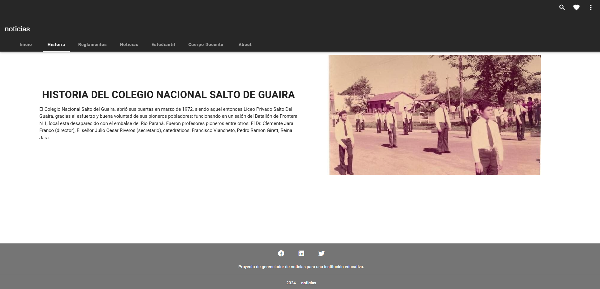

# noticias_cliente

## Project setup  Esto se realiza al inicio
```
npm install
```

### Compiles and hot-reloads for development
```
npm run serve
```

### Compiles and minifies for production
```
npm run build
```

### Customize configuration
See [ Configuration Reference] (https://cli.vuejs.org/config/).

### MANUAL DE COLABORACIÓN

<p align="center">
  <a href="https://youtu.be/hncREriQKYM?si=zxhALNRnTLVuP67Z" target="_blank">
    
  </a>
</p>

### Capturas


<p align="center">
  
</p>